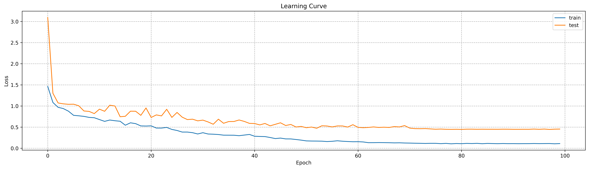
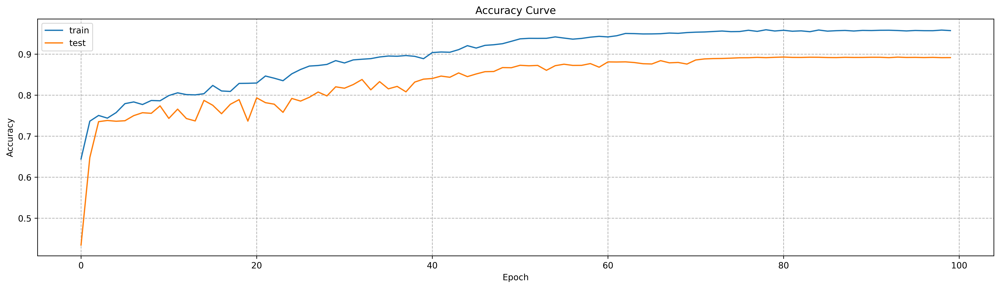
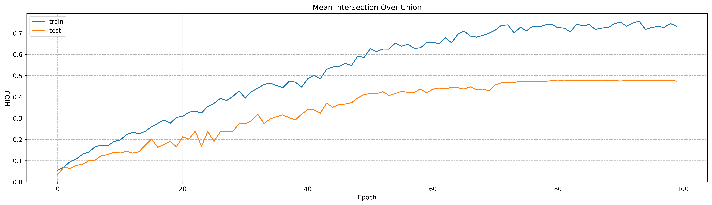

### FCN Model
In this project, I try to implement an easy understanding FCN model to achieve the task of semantic segmentation on VOC2012 dataset which have 21 classification including background, aeroplane and so on. 
The detailed classification of samples can be found at the file of VOCDatasetLoader.py.
After with 100 epoch training, the classified accuracy of model at the level of pixels reaches 89.3% and the average mean intersection over union reaches 0.48 which is excessively low. 

### Experiment Setting

All our experiments are implemented on a server with two Tesla T4 GPUs. 
Open-source framework python 3.7.16 and pytorch 1.7.1 are used to achieve our model. 

### Data Preprocessing

In this project, only two methods are used to process image samples. 
The first one is normalization, where each channel of images would be normalized based on mean and standard deviation. 
The second one is image cropping. Each image would be cropped to 300 by 480 pixels. 
The detailed information about preprocessing would be displayed at the file of VOCDataSetLoader.py.

### File Structure
- basic_trainer.py
  - This file is composed of sever approach to support model training well. This file would be call at the file of trainModel.py.
- ConfusionMatrix.py:
  - This file is the implementation of confusion matrix which is based on pytorch.
- FCN_ResNet.py: 
  - This file is used to construct whole model where RestNet18 serve as skeleton combines with deconvolution to achieve FCN model.
- resultShowcase.py: 
  - The display of experiments are implemented on this file.
- trainModel.py: 
  - As a startup entry for program is used to train model.
- Utils.py
  - This file is consist of accessories of training model such as method to load trained model and to save and load training parameters including loss, accuracy, MIOU and so on.
- VocDataSetLoader.py
  - This file is used to load and process raw data for feeding model.

### Startup of Training Model
```python
python -m torch.distributed.launch --nproc_per_node=2   ./FCN_practice/trainModel.py --seed=7 --multiprocessing_distributed=1 --ngpus_per_node=2
```
### Experiment Results

#### Learning Curve


#### Accuracy Curve


#### MIOU Curve


#### Case Study

